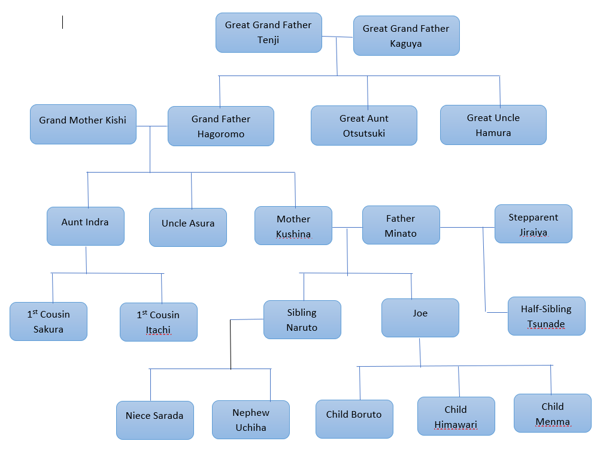
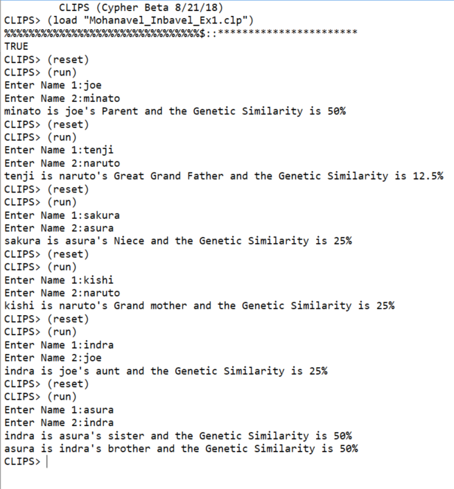

# AI Family Tree using ClIPS
Using CLIPS program by asking two names and determine the relations between then as well as the genetic similarity between them

# <h1> 1) Family Tree

  
# <h1> 1) Output

